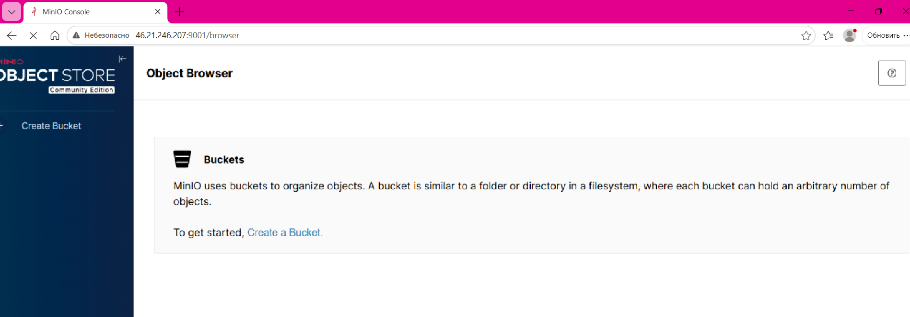

# Лабораторная работа №3: Облако (Advanced) - Вариант 2

## Цель работы:

С помощью Terraform создать виртуальную машину, затем Ansible-плейбуком установить на неё MinIO и проверить работу хранилища.

## Ход работы:

1. Ставим ansible

Ansible позволяет автоматизировать развертывание программного обеспечения, настройку серверов, оркестрацию сложных рабочих процессов и многое другое. Он работает на основе SSH, что делает его “безагентным” – не нужно устанавливать специальное ПО на управляемые машины (кроме SSH-сервера, который обычно уже есть).

```bash
sudo apt install software-properties-common -y
sudo apt-add-repository --yes --update ppa:ansible/ansible
sudo apt install ansible -y
```

2. Ставим terraform для создания виртаульной машины

Terraform позволяет описывать и управлять инфраструктурой с помощью декларативных конфигурационных файлов. Вместо того, чтобы вручную кликать в веб-консоли облачного провайдера, мы пишем код, который Terraform интерпретирует и применяет.

```bash
wget https://releases.hashicorp.com/terraform/1.5.7/terraform_1.5.7_linux_amd64.zip
unzip terraform_1.5.7_linux_amd64.zip
sudo mv terraform /usr/local/bin/
```

3. Создаем ssh ключ для сервера

SSH (Secure Shell) - это сетевой протокол, который обеспечивает безопасный способ удаленного доступа к компьютерам и управления ими. Он, как уже было упомянуто выше, нужен нам для Ansible

```bash
ssh-keygen -t rsa -b 4096 -C "vesus0206@gmail.com"
```

4. Используем облако Яндекса - Яндекс Cloud (потому что российское, известное и легко справиться с моментом привязки карты)

```bash
nano main.tf
```

```
terraform {
  required_providers {
    yandex = {
      source = "yandex-cloud/yandex"
    }
  }
}

provider "yandex" {
  token = "token"
  cloud_id = "cloud_id"
  folder_id = "folder id"
  zone = "ru-central1-a"
}

resource "yandex_vpc_network" "lab-network" {
  name = "lab-network"
}

resource "yandex_vpc_subnet" "lab-subnet" {
  name = "lab-subnet"
  zone = "ru-central1-a"
  network_id = yandex_vpc_network.lab-network.id
  v4_cidr_blocks = ["192.168.10.0/24"]
}

data "yandex_compute_image" "ubuntu" {
  family = "ubuntu-2204-lts"
}

resource "yandex_compute_instance" "minio-server" {
  name = "minio-server"
  platform_id = "standard-v3"
  zone = "ru-central1-a"

  resources {
    cores = 2
    memory = 4
  }

  boot_disk {
    initialize_params {
      image_id = data.yandex_compute_image.ubuntu.id
      size = 10
    }
  }

  network_interface {
    subnet_id = yandex_vpc_subnet.lab-subnet.id
    nat = true
  }

  metadata = {
    ssh-keys = "ubuntu:${file("~/.ssh/id_rsa.pub")}"
  }
}

output "external_ip" {
  value = yandex_compute_instance.minio-server.network_interface.0.nat_ip_address
}
```

```bash
terraform init
```

```bash
terraform apply -auto-approve
```

```
Apply complete! Resources: 1 added, 0 changed, 0 destroyed.

Outputs:

external_ip = "46.21.246.207"
```

5. Ставим MinIO, создаем файл шаброна и пишем плейбук

MinIO позволяет хранить и извлекать данные в виде файлов. Он подходит для хранения больших объемов неструктурированных данных, таких как резервные копии, медиафайлы, логи или данные для машинного обучения (чем наша работа, конечно, не является, но задание есть задание)

```bash
nano invetory.ini
```

```
[minio]
46.21.246.207 ansible_user=ubuntu ansible_ssh_common_args='-o StrictHostKeyChecking=no'
```

```jinja2
[Unit]
Description=MinIO Object Storage Server
Documentation=https://docs.min.io
Wants=network-online.target
After=network-online.target
AssertFileIsExecutable=/usr/local/bin/minio

[Service]
Environment="MINIO_ROOT_USER={{ minio_access_key }}"
Environment="MINIO_ROOT_PASSWORD={{ minio_secret_key }}"

ExecStart=/usr/local/bin/minio server /data --console-address ":{{ minio_api_port }}"

Restart=always
RestartSec=10

Type=simple

[Install]
WantedBy=multi-user.target
```

```yml
- name: Install and configure MinIO
  hosts: minio
  become: yes
  vars:
    minio_access_key: "madamedecim"
    minio_secret_key: "change_me"
    minio_api_port: 9001

  tasks:
    - name: Update apt cache
      apt:
        update_cache: yes

    - name: Install wget and other necessary tools
      apt:
        name:
          - wget
          - systemd
        state: present

    - name: Download MinIO server binary
      get_url:
        url: https://dl.min.io/server/minio/release/linux-amd64/minio
        dest: /usr/local/bin/minio
        mode: '0755'

    - name: Create MinIO data directory
      file:
        path: /data
        state: directory
        owner: root
        group: root
        mode: '0755'

    - name: Create MinIO systemd service file
      template:
        src: templates/minio.service.j2
        dest: /etc/systemd/system/minio.service
        owner: root
        group: root
        mode: '0644'
      notify: Restart MinIO

  handlers:
    - name: Restart MinIO
      systemd:
        name: minio
        state: restarted
        daemon_reload: yes
```

```bash
ansible-playbook -i inventory.ini playbook.yml
```

```
PLAY [Install and configure MinIO] *************************************************************************************************

TASK [Gathering Facts] *************************************************************************************************************
[WARNING]: Platform linux on host 46.21.246.207 is using the discovered Python interpreter at /usr/bin/python3.10, but future
installation of another Python interpreter could change the meaning of that path. See https://docs.ansible.com/ansible-
core/2.17/reference_appendices/interpreter_discovery.html for more information.
ok: [46.21.246.207]

TASK [Download MinIO server binary] ************************************************************************************************
changed: [46.21.246.207]

TASK [Create MinIO data directory] *************************************************************************************************
changed: [46.21.246.207]

TASK [Create systemd service file for MinIO] ***************************************************************************************
changed: [46.21.246.207]

TASK [Start and enable MinIO service] **********************************************************************************************
changed: [46.21.246.207]

PLAY RECAP *************************************************************************************************************************
46.21.246.207              : ok=5    changed=4    unreachable=0    failed=0    skipped=0    rescued=0    ignored=0 
```

6. Тест - перейдем по адресу нашего облака

Если MinIO запущен и доступен по указанному IP и порту, мы увидим веб-интерфейс MinIO со списком бакетов, которых пока нет, потому что мы ничего не создавали



Вывод: Хранилище работает, лабораторная успешно выполнена

